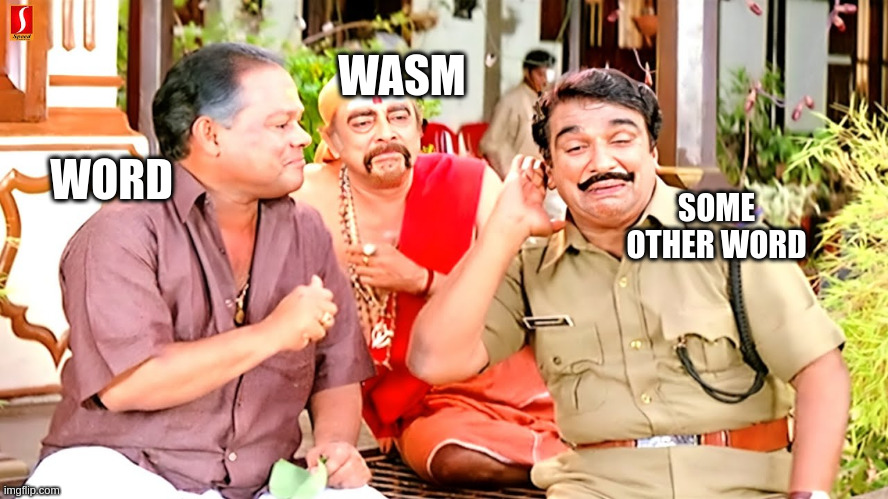

# chumma-ttf 

## chumma-ttf is a ttf file that runs WebAssembly to replace certain words as we type using harfbuzz text shaping engine.
### More details [here](https://github.com/harfbuzz/harfbuzz/blob/main/docs/wasm-shaper.md)


# Configuration 
- Configuration of chumma-ttf requires [harfbuzz](https://github.com/harfbuzz/harfbuzz) library built with WebAssembly Support and [wasm-macro-runtime](https://github.com/bytecodealliance/wasm-micro-runtime) library.
## Building and setting up the libraries
### Dependencies
`meson, pkg-config, ragel, gcc, freetype2, glib2, glib2-devel, cairo`
Install these packages from your distro package manager

### Building wasm-macro-runtime
   ```
   git clone https://github.com/bytecodealliance/wasm-micro-runtime/ && cd wasm-macro-runtime
   cmake -B build -DWAMR_BUILD_REF_TYPES=1 -DWAMR_BUILD_FAST_JIT=1
   cmake --build build --parallel
   ```
   **Note: if you want to install wasm-macro-runtime as a global shared object run this command too.**
   ```
   sudo cmake --build build --target install
   ```
   install it globally or use it from the directory build/ with the name `libiwasm.so`

### Building Harfbuzz with WebAssembly support

```
      git clone https://github.com/harfbuzz/harfbuzz
      cd harfbuzz
      meson setup build -Dwasm=enabled
```

Make sure the output of the last command contains

```
…
 Additional shapers
 Graphite2 : NO
 WebAssembly (experimental): YES
 …

```

**Now for building run:**
```
meson compile -C build
```
**You will have the library built as shared objects in `build/src` directory, since these shared objects would probably be installed in our system by default(a lot of softwares use harfbuzz as text shaping engine)
the only shared object we will need will be `libharfbuzz.so.0.6XXXX.0`** 

## Generating Chumma-ttfs

```
git clone https://github.com/7h3cyb3rm0nk/chumma-ttf
cd chumma-ttf
```
You can edit src/words.conf to replace certain words when typed with chumma ttf

**Example words.conf file**
```
#This is a comment
#Format is 'word:word-to-be-replace'
#Example:
Hello:Hi
pics:pigs
sweet:shit
```

**Now to generate the tttf file run this command inside the parent directory:**
```
make
```
the font file will be generated as `chumma.ttf`
run this command to use it
```
cp chumma.ttf ~/.local/share/fonts/
fc-cache
```

# Using the ttf 
In order to run Wasm inside the ttf you have to preload the shared objects using [LD_PRELOAD](https://man7.org/linux/man-pages/man8/ld.so.8.html) environment variable
run
```
export LD_PRELOAD=/path/to/libiwasm.so:/path/to/libharfbuzz.so.0.6XXXX.0
```
to preload them

**now you can use gedit or any software that uses harfbuzz text shaping engine to use this font and have fun**


### Related works and inspirations:
- [fuglede.github.io/llama.ttf/](https://fuglede.github.io/llama.ttf/)
- [LLAMATTF - How to run](https://7h3cyb3rm0nk.medium.com/llamattf-run-llm-inside-a-font-file-161709907630)
- [github.com/Erk-/programmable-fonts](https://github.com/Erk-/programmable-fonts)
- [github.com/harfbuzz/harfbuzz-wasm-examples - Example fonts using harfbuzz wasm shaper](https://github.com/harfbuzz/harfbuzz-wasm-examples)


